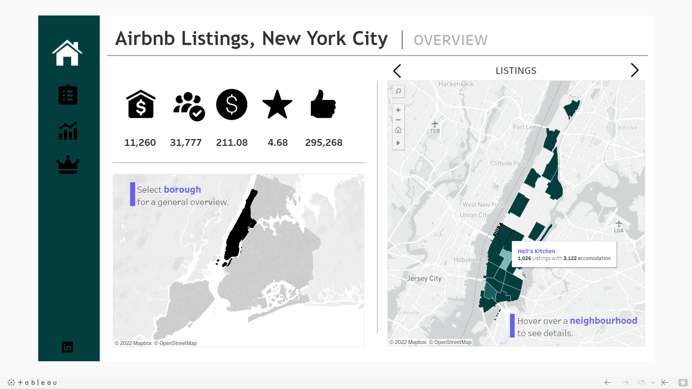
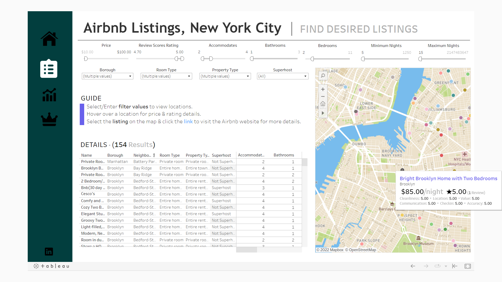

 

## Exploratory Data Analysis

- 
- 
- 

---

### Viewing the Data
- Querying in **SSMS (SQL Server Management Studio)** using self-joins, CTEs, procedures, and group by to view the required data.
- Data Cleaning: Handling null values, duplicates, and ensuring consistency in data types.
- Data Analysis: Answering key business questions like listing trends, price analysis, and location-based popularity.
- Data Transformation: Preparing data for dashboard visualization in Tableau.

---

### Dashboard
- **Overview**: Listings, available accommodations, average price ($), average rating, and total reviews info per borough.
  

- **Filtering**: Options to find desired locations and links to the Airbnb website for more detailed listings.
  

- **Key Insights**: Insights on boroughs, room types, pricing trends, reviews, and host information.
  

- **Superhosts vs Non-Superhosts**: Analyzing the performance difference between superhosts and non-superhosts in terms of reviews, occupancy, and pricing.
  

---

### Tech Stack

-  **Excel**: Data exploration and preliminary analysis.
-  **SQL (SQL Server Management Studio)**: For querying and manipulating the data.
-  **Tableau**: Data visualization and dashboard creation.
-  **Figma**: Used for designing dashboard layouts and user interfaces.
-  **Mapbox**: For creating interactive maps used in the dashboard.
-  **Python**: (pandas, seaborn, matplotlib) For data manipulation, analysis, and visualizing correlations.
